# Notes for Discussing Intel GPU Architecture

[Graphics processing technology has evolved to deliver unique benefits in the world of computing. The latest graphics processing units (GPUs) unlock new possibilities in gaming, content creation, machine learning, and more.](https://www.intel.com/content/www/us/en/products/docs/processors/what-is-a-gpu.html)

Both CPU and GPU are [von Neumann architecture: stored-program computer](https://en.wikipedia.org/wiki/Von_Neumann_architecture).

The Graphics Processing Unit (GPU) provides much higher **instruction throughput** and **memory bandwidth** than the CPU within a similar **price** and **power** envelope. (Reference from: [CUDA C++ Programming Guide](https://docs.nvidia.com/cuda/cuda-c-programming-guide/index.html).)

# Intel GPU Overview
Before Gen12, Intel provides on-die integrated processor graphics architecture which offers **graphics**, **compute**, **media**, and **display** capabilities. For example, Intel® Core™ i7 processor 6700K is a one-slice instantiation of Intel processor graphics gen9 architecture.

  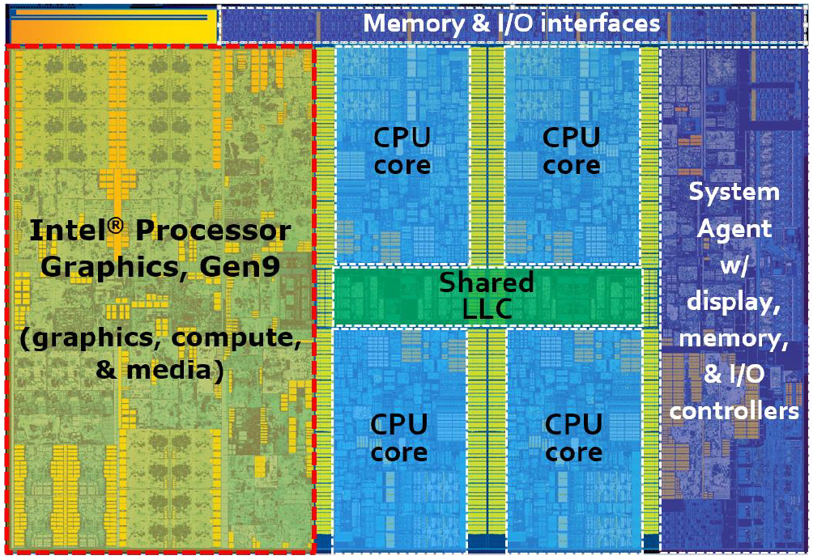

[The Compute Architecture of Intel® Processor Graphics Gen9, Page 3](https://www.intel.com/content/dam/develop/external/us/en/documents/the-compute-architecture-of-intel-processor-graphics-gen9-v1d0-166010.pdf)

## Intel GPU Block Diagram
Traditionally, GPU contains following components:
- Display/Overlay
- Blitter: Block Image Transferrer, Copy Engine
- GPE: Graphic Processing Engine, Render Engine, including 3D, Compute and Programmable Media workload
- VCE: Video Codec Engine, evolved to Multi-Format Codec (MFX) Engine, Video Enhancement Engine

  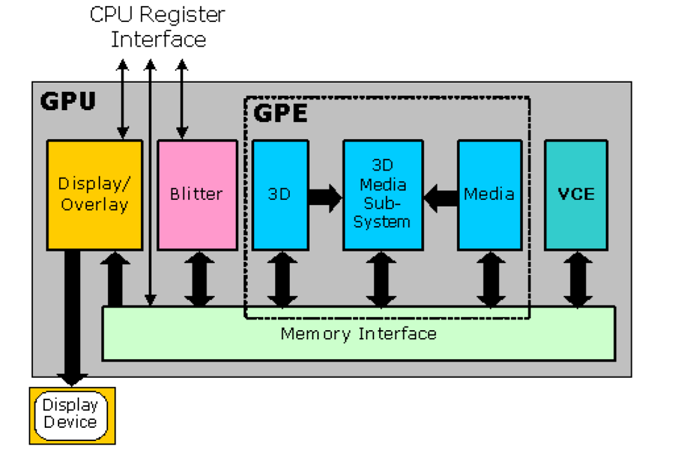

[INTEL® UHD GRAPHICS OPEN SOURCE PROGRAMMER'S REFERENCE MANUAL FOR THE 2020 INTEL CORE™ PROCESSORS WITH INTEL HYBRID TECHNOLOGY BASED ON THE "LAKEFIELD" PLATFORM, Volume 3: GPU Overview, Page 1](https://01.org/sites/default/files/documentation/intel-gfx-prm-osrc-lkf-vol03-gpu_overview.pdf)

From command stream programming view, GPU hardware consists of multiple parallel engines:
- Blitter Engine, Copy Engine
- Video Ehancement Engine
- Video Decoder Engine, should mean MFX Engine including video decode and encode functions
- Render Engine, 3D, Compute and Programmable Media funcitons

  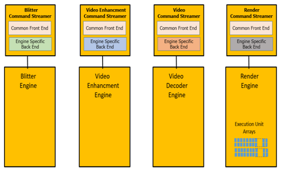

[INTEL® UHD GRAPHICS OPEN SOURCE PROGRAMMER'S REFERENCE MANUAL FOR THE 2020 INTEL CORE™ PROCESSORS WITH INTEL HYBRID TECHNOLOGY BASED ON THE "LAKEFIELD" PLATFORM, Volume 8: Command Stream Programming, Page 1](https://01.org/sites/default/files/documentation/intel-gfx-prm-osrc-lkf-vol08-command_stream_programming.pdf)

**Compute Command Streamer is showing in DG1 PRM. It should be a dedicated command streamer for compute/GPGPU, separated from RCS.** 

[INTEL® IRIS® XE MAX GRAPHICS OPEN SOURCE PROGRAMMER'S REFERENCE MANUAL FOR THE 2020 DISCRETE GPU FORMERLY NAMED "DG1", Volume 8: Command Stream Programming, Page 30](https://01.org/sites/default/files/documentation/intel-gfx-prm-osrc-dg1-vol08-command_stream_programming.pdf)

## Render Engine
Moving into Render Engine, it contains to pipeline:
- 3D pipeline is traditional workload with long pipeline stages 
-  Media pipeline is evovled to general purpose compute

  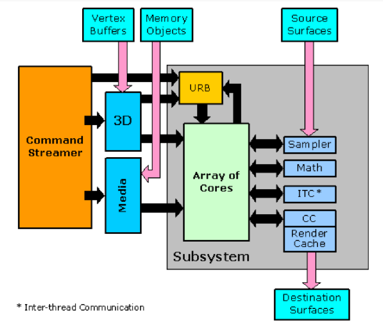

[INTEL® UHD GRAPHICS OPEN SOURCE PROGRAMMER'S REFERENCE MANUAL FOR THE 2020 INTEL CORE™ PROCESSORS WITH INTEL HYBRID TECHNOLOGY BASED ON THE "LAKEFIELD" PLATFORM, Volume 3: GPU Overview, Page 2](https://01.org/sites/default/files/documentation/intel-gfx-prm-osrc-lkf-vol03-gpu_overview.pdf)

[INTEL® UHD GRAPHICS OPEN SOURCE PROGRAMMER'S REFERENCE MANUAL FOR THE 2020 INTEL CORE™ PROCESSORS WITH INTEL HYBRID TECHNOLOGY BASED ON THE "LAKEFIELD" PLATFORM, Volume 9: Render Engine, Page 299](https://01.org/sites/default/files/documentation/intel-gfx-prm-osrc-lkf-vol09-renderengine.pdf)

*The Unified Return Buffer (URB) is as a temporary holding area that handles the process of thread creation and dispatch.*

Work into the Render/GPGPU engine is fed using the Render Command Streamer.

  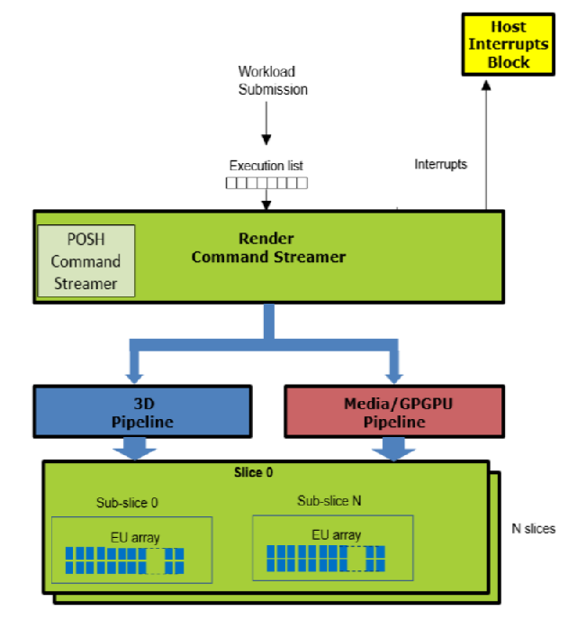

[INTEL® UHD GRAPHICS OPEN SOURCE PROGRAMMER'S REFERENCE MANUAL FOR THE 2020 INTEL CORE™ PROCESSORS WITH INTEL HYBRID TECHNOLOGY BASED ON THE "LAKEFIELD" PLATFORM, Volume 9: Render Engine, Page 2](https://01.org/sites/default/files/documentation/intel-gfx-prm-osrc-lkf-vol09-renderengine.pdf)

*Position only shader (POSH) is for 3D pipeline.*

# Compute Resource Hierarchy
From Gen7.5, Intel keeps same GPU's compute resource hierarchy, **GPU/Slice/Subslice/EU**, to Gen9.5 and Gen11. 

## GPU
A potential product design that instantiates the compute architecture of Intel® processor graphics gen9. This design is composed of three slices, of three subslices each for a total of 72 EUs.

  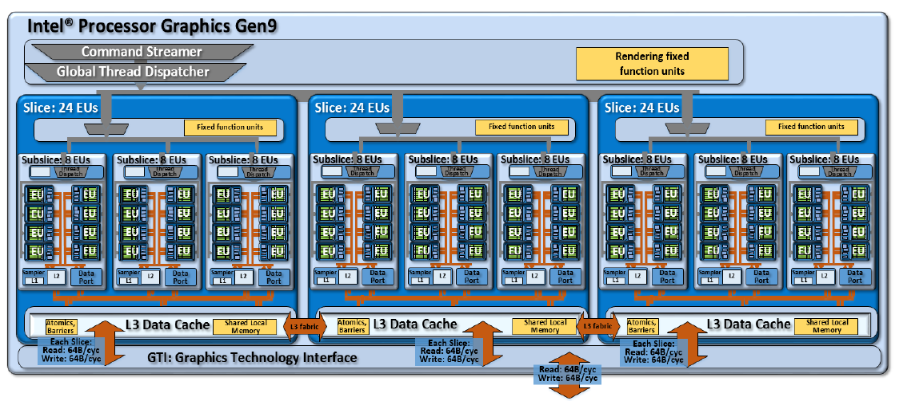

- Global Thread dispatcher
- Every slice have their own data cache and interface to access DRAM.
- GPU RAM bandwidth: from DRAM to cache, depending on the number of RAM interface lanes and frequency. 

## Slice
The Intel processor graphics gen9 slice, containing three subslices for a total of 24 EUs. The slice adds supporting L3 cache, shared local memory, atomics, barriers, and other fixed function units.

  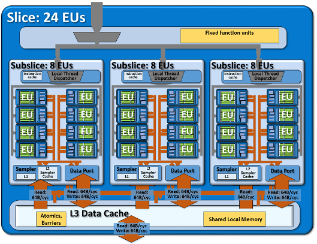

## Subslice
The Intel processor graphics Gen9 subslice, containing 8 EUs each. The subslice also instantiates sampler and data port units per subslice.

  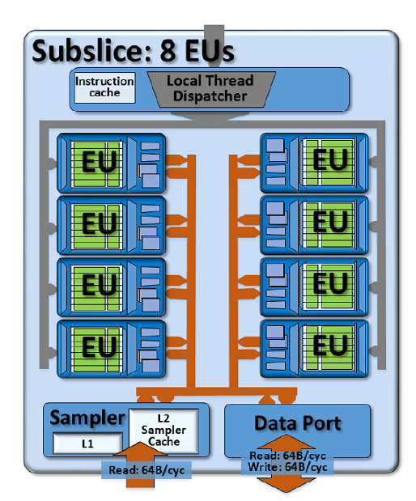

Each subslice contains its own **local thread dispatcher** unit, **data port/cache** and its own supporting **instruction caches**.

## EU
The Execution Unit (EU). Each gen9 EU has seven threads. Each thread has 128 SIMD-8 32-bit registers (GRF) and supporting architecture specific registers (ARF). The EU can co-issue to four instruction processing units including two FPUs, a branch unit, and a message send unit.

  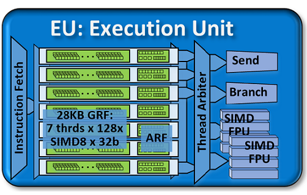

[The Compute Architecture of Intel® Processor Graphics Gen9, Page 6, 9, 10, 14](https://www.intel.com/content/dam/develop/external/us/en/documents/the-compute-architecture-of-intel-processor-graphics-gen9-v1d0-166010.pdf)

EUs support a rich instruction set. This instruction set has been optimized to support various 3D API shader languages, media functions processing, and compute kernels.

- ALU/FPU/SIMD: EU native instructions are 128 bits (16 bytes) wide. Some combinations of instruction options can use compact instruction formats that are 64 bits (8 bytes) wide.
- GRF: For gen9-based products, each EU thread has 128 general purpose registers. Each register stores 32 bytes, accessible as a SIMD 8-element vector of 32-bit data elements. Thus each gen9 thread has 4 Kbytes of general purpose register file (GRF).
- ARF: Per-thread architectural state is maintained in a separate dedicated architecture register file (ARF).

### Data Port
The Data Port provides all memory accesses for the subsystem other than those provided by the sampling engine. These include constant buffer reads, scratch space reads/writes, and media surface accesses.
The diagram below shows how the Read-Only and Read/Write Data Ports connect with the caches and memory subsystem. The execution units and sampling engine are shown for clarity.
Data Port Connections to Caches and Memory

  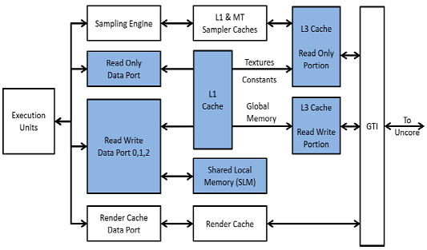

[INTEL® UHD GRAPHICS OPEN SOURCE PROGRAMMER'S REFERENCE MANUAL FOR THE 2020 INTEL CORE™ PROCESSORS WITH INTEL HYBRID TECHNOLOGY BASED ON THE "LAKEFIELD" PLATFORM, Volume 9: Render Engine, Page 657](https://01.org/sites/default/files/documentation/intel-gfx-prm-osrc-lkf-vol09-renderengine.pdf)

### Messsage Flow
Communication between the EUs and the shared functions and between the fixed function pipelines (which are not considered part of the "Subsystem") and the EUs is accomplished via packets of information called messages. Message transmission is requested via the send instruction.

  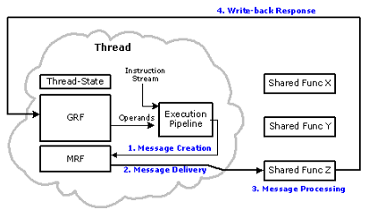

[INTEL® UHD GRAPHICS OPEN SOURCE PROGRAMMER'S REFERENCE MANUAL FOR THE 2020 INTEL CORE™ PROCESSORS WITH INTEL HYBRID TECHNOLOGY BASED ON THE "LAKEFIELD" PLATFORM, Volume 9: Render Engine, Page 348](https://01.org/sites/default/files/documentation/intel-gfx-prm-osrc-lkf-vol09-renderengine.pdf)

- MRF

# Workload Mapping
A workload shuould be decomposed into workgroups and work items, and adapated to GPU processing element(core/ALU).
[ An example (The OpenCL™ Specification Execution Model section) of an NDRange index space showing work-items, their global IDs and their mapping onto the pair of work-group and local IDs.](https://www.khronos.org/registry/OpenCL/specs/3.0-unified/html/OpenCL_API.html#_mapping_work_items_onto_an_ndrange)

  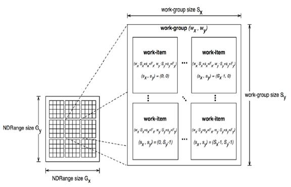

- SIMD, vector
- SIMT, scalar
- workgroup fit into subslice
- work item is mapping with SIMD and thread
- branch and mask
- multiple task/work list

**The compiler is responsible for mapping work items with threads and SIMD.**
The compiler determines how many SIMD channels are needed per thread group, and then decides how these are split among EU threads. The number of threads is programmed in the thread counter, and the SIMD mode (SIMD8/SIMD16/SIMD32) is specified in the GPGPU_WALKER command.

[INTEL® UHD GRAPHICS OPEN SOURCE PROGRAMMER'S REFERENCE MANUAL FOR THE 2020 INTEL CORE™ PROCESSORS WITH INTEL HYBRID TECHNOLOGY BASED ON THE "LAKEFIELD" PLATFORM, Volume 9: Render Engine, Page 317](https://01.org/sites/default/files/documentation/intel-gfx-prm-osrc-lkf-vol09-renderengine.pdf)

