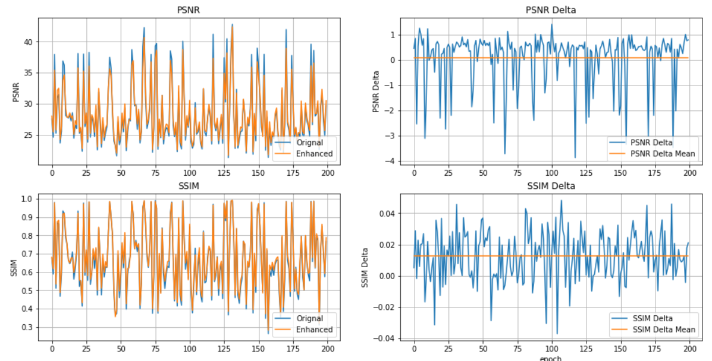
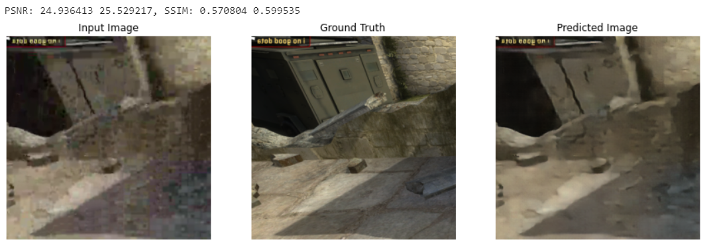

## Video Quality Ehancement Using GAN

Before Chinese New Year, a server with 2 sockets CPUs(24x2 cores), a 1080Ti GPU, 1T AEP memory and 2 NVME disks have been set up finally. I think it's enough for most of simple deep learning model.

I'll try to apply GAN on video frame for video quality enhancement at this time, like [pix2pix model](https://www.tensorflow.org/tutorials/generative/pix2pix).


## Preparing

The test content is [CSGO](https://media.xiph.org/video/derf/twitch/Uncompressed/CSGO.mov) from [xiph](https://media.xiph.org/video/derf/). I encode it with Intel Media SDK sampe, the key parameters: 2Mbps, 60fps and speed mode. Yes, it's a very low bitrate for this heavy moving video. So, the video quality is very low (PSNR ~28, SSIM 0.65). 

After encoding and decoding, I transfer the video image to RGB space frame by frame. The input is video after encoder and decoder, the target is the source video for encoder.

## Model

For simple test, I keep the model like pix2pix, just change the input to 512 x 512(crop from 1920 x 1080 video)

Here is the generator

```javascript
Model: "model"
__________________________________________________________________________________________________
Layer (type)                    Output Shape         Param #     Connected to                     
==================================================================================================
input_1 (InputLayer)            [(None, 512, 512, 3) 0                                            
__________________________________________________________________________________________________
sequential (Sequential)         (None, 256, 256, 64) 3072        input_1[0][0]                    
__________________________________________________________________________________________________
sequential_1 (Sequential)       (None, 128, 128, 128 131584      sequential[0][0]                 
__________________________________________________________________________________________________
sequential_2 (Sequential)       (None, 64, 64, 256)  525312      sequential_1[0][0]               
__________________________________________________________________________________________________
sequential_3 (Sequential)       (None, 32, 32, 512)  2099200     sequential_2[0][0]               
__________________________________________________________________________________________________
sequential_4 (Sequential)       (None, 16, 16, 512)  4196352     sequential_3[0][0]               
__________________________________________________________________________________________________
sequential_5 (Sequential)       (None, 8, 8, 512)    4196352     sequential_4[0][0]               
__________________________________________________________________________________________________
sequential_6 (Sequential)       (None, 4, 4, 512)    4196352     sequential_5[0][0]               
__________________________________________________________________________________________________
sequential_7 (Sequential)       (None, 2, 2, 512)    4196352     sequential_6[0][0]               
__________________________________________________________________________________________________
sequential_8 (Sequential)       (None, 1, 1, 512)    4196352     sequential_7[0][0]               
__________________________________________________________________________________________________
sequential_9 (Sequential)       (None, 2, 2, 512)    4196352     sequential_8[0][0]               
__________________________________________________________________________________________________
concatenate (Concatenate)       (None, 2, 2, 1024)   0           sequential_9[0][0]               
                                                                 sequential_7[0][0]               
__________________________________________________________________________________________________
sequential_10 (Sequential)      (None, 4, 4, 512)    8390656     concatenate[0][0]                
__________________________________________________________________________________________________
concatenate_1 (Concatenate)     (None, 4, 4, 1024)   0           sequential_10[0][0]              
                                                                 sequential_6[0][0]               
__________________________________________________________________________________________________
sequential_11 (Sequential)      (None, 8, 8, 512)    8390656     concatenate_1[0][0]              
__________________________________________________________________________________________________
concatenate_2 (Concatenate)     (None, 8, 8, 1024)   0           sequential_11[0][0]              
                                                                 sequential_5[0][0]               
__________________________________________________________________________________________________
sequential_12 (Sequential)      (None, 16, 16, 512)  8390656     concatenate_2[0][0]              
__________________________________________________________________________________________________
concatenate_3 (Concatenate)     (None, 16, 16, 1024) 0           sequential_12[0][0]              
                                                                 sequential_4[0][0]               
__________________________________________________________________________________________________
sequential_13 (Sequential)      (None, 32, 32, 512)  8390656     concatenate_3[0][0]              
__________________________________________________________________________________________________
concatenate_4 (Concatenate)     (None, 32, 32, 1024) 0           sequential_13[0][0]              
                                                                 sequential_3[0][0]               
__________________________________________________________________________________________________
sequential_14 (Sequential)      (None, 64, 64, 256)  4195328     concatenate_4[0][0]              
__________________________________________________________________________________________________
concatenate_5 (Concatenate)     (None, 64, 64, 512)  0           sequential_14[0][0]              
                                                                 sequential_2[0][0]               
__________________________________________________________________________________________________
sequential_15 (Sequential)      (None, 128, 128, 128 1049088     concatenate_5[0][0]              
__________________________________________________________________________________________________
concatenate_6 (Concatenate)     (None, 128, 128, 256 0           sequential_15[0][0]              
                                                                 sequential_1[0][0]               
__________________________________________________________________________________________________
sequential_16 (Sequential)      (None, 256, 256, 64) 262400      concatenate_6[0][0]              
__________________________________________________________________________________________________
concatenate_7 (Concatenate)     (None, 256, 256, 128 0           sequential_16[0][0]              
                                                                 sequential[0][0]                 
__________________________________________________________________________________________________
conv2d_transpose_8 (Conv2DTrans (None, 512, 512, 3)  6147        concatenate_7[0][0]              
==================================================================================================
Total params: 67,012,867
Trainable params: 66,999,939
Non-trainable params: 12,928
__________________________________________________________________________________________________
```

Here is the discriminator.
```javascript
Model: "model_1"
__________________________________________________________________________________________________
Layer (type)                    Output Shape         Param #     Connected to                     
==================================================================================================
input_image (InputLayer)        [(None, 512, 512, 3) 0                                            
__________________________________________________________________________________________________
target_image (InputLayer)       [(None, 512, 512, 3) 0                                            
__________________________________________________________________________________________________
concatenate_8 (Concatenate)     (None, 512, 512, 6)  0           input_image[0][0]                
                                                                 target_image[0][0]               
__________________________________________________________________________________________________
sequential_17 (Sequential)      (None, 256, 256, 64) 6144        concatenate_8[0][0]              
__________________________________________________________________________________________________
sequential_18 (Sequential)      (None, 128, 128, 128 131584      sequential_17[0][0]              
__________________________________________________________________________________________________
sequential_19 (Sequential)      (None, 64, 64, 256)  525312      sequential_18[0][0]              
__________________________________________________________________________________________________
sequential_20 (Sequential)      (None, 32, 32, 256)  1049600     sequential_19[0][0]              
__________________________________________________________________________________________________
sequential_21 (Sequential)      (None, 16, 16, 256)  1049600     sequential_20[0][0]              
__________________________________________________________________________________________________
sequential_22 (Sequential)      (None, 8, 8, 256)    1049600     sequential_21[0][0]              
__________________________________________________________________________________________________
zero_padding2d (ZeroPadding2D)  (None, 10, 10, 256)  0           sequential_22[0][0]              
__________________________________________________________________________________________________
conv2d_15 (Conv2D)              (None, 7, 7, 512)    2097152     zero_padding2d[0][0]             
__________________________________________________________________________________________________
batch_normalization_21 (BatchNo (None, 7, 7, 512)    2048        conv2d_15[0][0]                  
__________________________________________________________________________________________________
leaky_re_lu_15 (LeakyReLU)      (None, 7, 7, 512)    0           batch_normalization_21[0][0]     
__________________________________________________________________________________________________
zero_padding2d_1 (ZeroPadding2D (None, 9, 9, 512)    0           leaky_re_lu_15[0][0]             
__________________________________________________________________________________________________
conv2d_16 (Conv2D)              (None, 6, 6, 1)      8193        zero_padding2d_1[0][0]           
==================================================================================================
Total params: 5,919,233
Trainable params: 5,915,905
Non-trainable params: 3,328
__________________________________________________________________________________________________
```
## Training and Evaluating

At beginnig, the generated frame PSNR are lower (few db) than input frame while following the defalut configuration. 

Adjust LAMBDA from 100 to 1000, it means more weights on L1 distance. I got a better PSNR and SSIM.




The predicted image removed the block effect, maybe ehnamce object edge.
